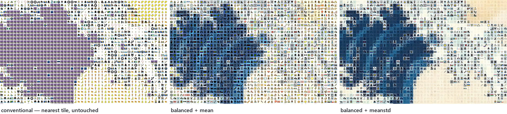
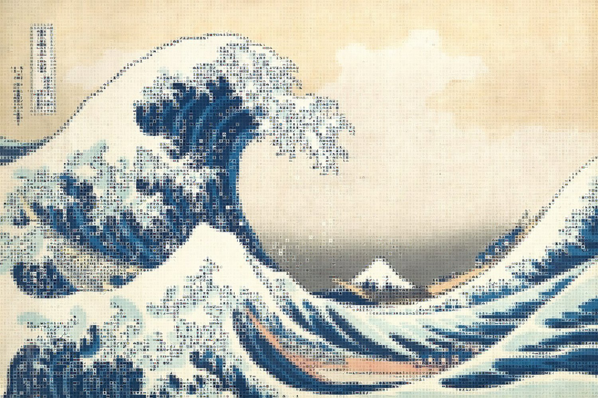

# Balanced Photo Mosaic

Rebuild a picture out of hundreds of smaller pictures — without using the same
handful of tiles over and over.



A conventional photomosaic picks, for every cell, whichever tile is closest in
colour. Ask that question of a large flat region and you get the same answer a few
thousand times — the repetition on the left above. On this example it used **436 of
1,200 available tiles, and a single tile covered 22.5% of the picture.**

This tool inverts the two steps. It hands out tiles from a shuffled sequence so
every tile is used about equally often, then **recolours** each one to match the
patch it landed on. Same example, same tiles: **all 1,200 used, none covering more
than 0.1%.** The colour match does the work that tile choice used to.

## Install and run

```bash
pip install pillow numpy
python photomosaic.py target.jpg tiles_folder/ --out mosaic.jpg
```

To try it without supplying anything of your own, `fetch_example.py` downloads a
public-domain painting and a set of tiles:

```bash
python fetch_example.py --target wave --tiles emoji
python photomosaic.py examples/wave-emoji/target.jpg examples/wave-emoji/tiles \
    --tile-size 32 --enlargement 6 --mode meanstd --out mosaic.jpg
```

That is Hokusai's *Great Wave* built from 1,200 OpenMoji emoji, and takes about
twenty seconds.

| `--target` | `--tiles` |
|---|---|
| `wave` — Hokusai, *The Great Wave off Kanagawa* | `emoji` — 1,200 OpenMoji, ~8 MB |
| `pearl` — Vermeer, *Girl with a Pearl Earring* | `cifar` — CIFAR-10 photographs, ~30 MB |
| `starry` — Van Gogh, *The Starry Night* | |

## The two choices

**How a tile is chosen** — `--select`:

| | |
|---|---|
| `balanced` *(default)* | Every tile used about equally, in shuffled order. Variety comes free, and the colour match has to carry the likeness. |
| `nearest` | The conventional photomosaic: closest tile by mean colour. Add `--no-recolor` for the classic look. |

**How it is recoloured** — `--mode`:

| | |
|---|---|
| `mean` | Shift the tile so its average colour matches the patch, keeping all of the tile's own contrast. |
| `meanstd` *(default)* | Match average *and* spread. |
| `luma` | Match brightness and contrast only, leaving the tile's hues alone. |

`meanstd` has a property worth knowing about, visible in the right-hand panel above.
The gain applied to a tile is the ratio of the patch's standard deviation to the
tile's own. In a flat region — open sky — that ratio is small, the tile's contrast
is crushed, and it melts into the background. Along an edge the ratio is large and
the tile keeps its detail. **Tiles show themselves where the target has structure
and hide where it does not**, which sharpens the features of the original instead of
fighting them.



## Options

| | |
|---|---|
| `--tile-size` | Edge of each tile in the output, in pixels. Smaller means more tiles and a closer likeness. |
| `--enlargement` | How much bigger the mosaic is than the target. With `--tile-size` this sets the grid. |
| `--mode` | `mean`, `meanstd`, `luma`. |
| `--select` | `balanced`, `nearest`. |
| `--no-recolor` | Paste tiles untouched. |
| `--seed` | Shuffle seed, so a run is reproducible. |
| `--out` | Output path. |

Every run reports how many of your tiles it actually used, and how much of the
mosaic the most-used one covers — the number this project exists to keep small.

## Walkthrough

[`walkthrough.ipynb`](walkthrough.ipynb) builds it one step at a time, with the
comparisons and the tile-usage numbers worked out as you go.

## Credits

Inspired by the classic best-fit photomosaic approach by
[codebox/mosaic](https://github.com/codebox/mosaic).

Nothing is redistributed here beyond the small example renders in `images/`. The
fetcher pulls paintings from Wikimedia Commons (all long in the public domain),
emoji from [OpenMoji](https://openmoji.org) (CC BY-SA 4.0), and photographs from
[CIFAR-10](https://www.cs.toronto.edu/~kriz/cifar.html).
